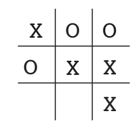
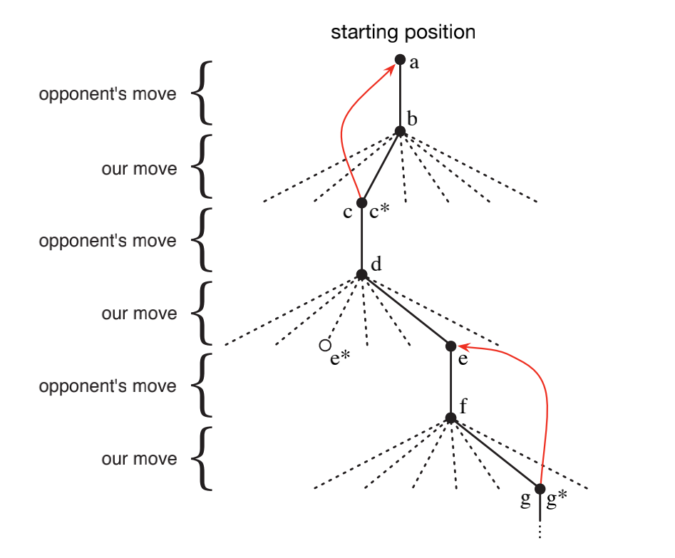

# 简单数学建模 Tic-Tac—Toe

2022/3/17

-----
## 问题分析

有3x3的网格。两名玩家，一名使用x标记，一名使用o标记。

胜利/失败条件：若有一名玩家无论在水平，垂直或是对角上使得三个标记连续，则胜利，另一玩家则失败。

平局条件：如果网格被填满但是没有一名玩家取得胜利，则平局。

此时假如有人与我们对战。假定我们最想要的结果是胜利，平局和失败对我们而言都是不好的结果。那我们此时应该如何找到最好的方法去最大化我们胜利的可能性。

在这种问题上，**传统的最大化问题已经无法解决**，因为对手是有“思维的”，他的套路不会一尘不变。经典的optimization methods for sequencial decisions problems需要我们输入对手全部的特征以及对手在某一步中采取某一个actions的概率才能工作。

因此，**我们最好的办法就是先与对手进行多局游戏，然后学习对手的行为，建立对手行为环境模型。然后再应用dynamic programming实现决策过程。**

## 遗传算法的设想（不采用）

在这个问题中，policy就是玩家在面对棋盘上形式作出选择的“条件反射”。也就是state到action的映射（在面对当前局势，你要如何做出反应）。如果使用遗传算法，则是在policy空间中选择一个胜率最高的policy。对于每一个policy的，只要将它与对手对战很多局，这样就可以产生这个policy的胜率，决定它是否被淘汰。

## 构建value function

下面则介绍如何应用value function的方法去解决这个问题（不用遗传算法）。首先我们建立一个数表，其中每一个单元格代表游戏中的每一个state。每一个单元格中的值代表在这个state下我们游戏的胜率。我们将这个表格的值称为state' value整个表格称为value function。假如state A相对state B有更高的值，也就是state A的胜率高于state B。

假设我们使用x标记。如果我们有一个state，其中有连续三个x，那么这个state value就是1，也就是胜率100%。类似的，如果有三个连续的o，那么这个state value就是0，胜率为0。在这个问题中，我们初始化value function的表格中的值都为0.5（因为这是个游戏）。

然后我们会和对手玩很多局游戏。

## 如何选择动作

为了简化，我们假设动作有p和q。我们要选择动作，则需要在value function这个表格中分别遍历如果我们选择了p或q到达的下一个state，并比较他们的value来决定我们下一个动作选择哪个最好。大部分时间，我们动作的选择都是贪婪的（选择会前往最高value的state的动作）。有的时候，我们也需要随机选择我的动作，这被称为exploratory moves，这可以让我们探索到未曾接触过的state。在每一次move后，我们都会复盘，修改state value，让它的值更接近我们的胜率。也就是让我们之前的state value更接近移动后到达的state的value。

## 如何更新state value

假设上一个state是$S_t$，经过我们的move之后下一个state是$S_{t+1}$，用V(S)代表state在value表格中的查询值。那么为了让上一个state更接近下一个state，我们需要知道他们之间的增量，也就是$\Delta V=V(S_{t+1})-V(S_{t})$。然后便可以得到更新公式：

$$
V(S_t) \leftarrow V(S_{t}) + a\Delta S = 
V(S_t) + a(V(S_{t+1})-V(S_t))
$$

其中a是控制“移动”程度的参数。