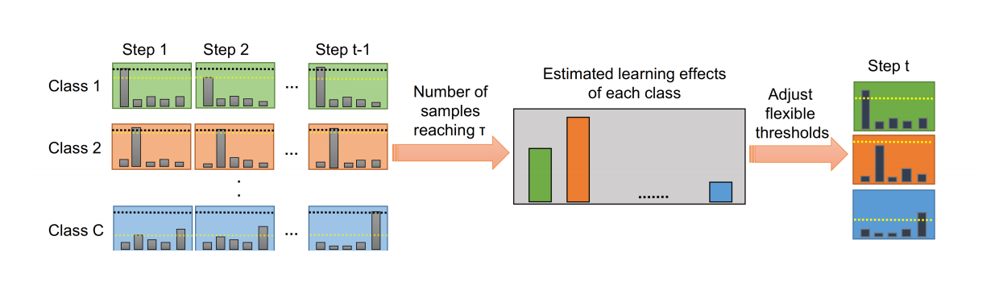

# [论文阅读] FlexMatch

> [!NOTE] 下载：[https://arxiv.org/pdf/2110.08263.pdf](https://arxiv.org/pdf/2110.08263.pdf)，[本地](papers/2110.08263.pdf)

> [!WARNING] 什么是Consistensy Regularization
> + [https://zhuanlan.zhihu.com/p/46893709](https://zhuanlan.zhihu.com/p/46893709)

# 摘要

提出了CPL（Curriculum Pseudo Labeling），这是一种可以根据学习过程中的状态去分类未标签数据，其实也就是**采用灵活调整阈值的方式**去分类。
CPL在每一个时间步（time step）调整阈值，给分类可信度最大的数据打上伪标签。

> [!ATTENTION] 什么是学习过程中的状态（learning status）？

# 过去工作

过去的一些SSL算法对**所有的分类都使用预先定义好的常量阈值**去训练。这样的算法**没有考虑到不同类别的训练难度和学习过程中不同的状态**。尽管这样的策略会保证分类可信度高的无标签数据对模型有帮助，但是忽略了训练早期大部分无标签数据其实无法达到这样的高阈值。

# 创新点/贡献

+ 提出了CPL，一个动态改变阈值的方法。
+ 这个算法运算效率与FixMatch相当，并且可以很容易结合进其他的SSL算法。
+ CPL大大增加了一些SSL算法的准确度和收敛速度。

# 数学模型

## 过去的模型

在SSL中，最基础的一致性损失是$\mathscr{l}-2 loss$：

$$
\sum_{b=1}^{\mu B}\left\|p_{m}\left(y \mid \omega\left(u_{b}\right)\right)-p_{m}\left(y \mid \omega\left(u_{b}\right)\right)\right\|_{2}^{2}
$$

> [!WARNING] 我很讨厌网上有的人介绍公式但是不介绍变量含义！

其中$B$是有标注数据集的大小，$\mu$是无标签数据比有标签数据的值，$\omega$是一个随机的数据增强函数（因为是随机的，所以这个公式可以有多种形式），$u_b$是一条无标签数据，$p_m$代表模型的输出。

引入了伪标签技术后，一致性损失就被转化到了熵最小化的形式（对于分类任务更好用）。改进后的一致性损失就写为：

$$
\frac{1}{\mu B} \sum_{b=1}^{\mu B} \mathbb{1}\left(\max \left(p_{m}\left(y \mid \omega\left(u_{b}\right)\right)\right)>\tau\right) H\left(\hat{p}_{m}\left(y \mid \omega\left(u_{b}\right)\right), p_{m}\left(y \mid \omega\left(u_{b}\right)\right)\right)
$$

其中$H$代表交叉熵（cross-entropy），$\tau$是预先定义的阈值（基础阈值），$\hat{p}_{m}\left(y \mid \omega\left(u_{b}\right)\right)$是伪标签。

在FixMatch中，它使用如上的一致性正则化（Consistency Regularization）和强数据增强去实现好的效果。对于无标签数据，FixMatch首先使用弱数据增强去生成伪标签。这些伪标签数据然后被作为强数据增强的数据。FixMatch中的无监督损失如下：

$$
\frac{1}{\mu B} \sum_{b=1}^{\mu B} \mathbb{1}\left(\max \left(p_{m}\left(y \mid \omega\left(u_{b}\right)\right)\right)>\tau\right) H\left(\hat{p}_{m}\left(y \mid \omega\left(u_{b}\right)\right), p_{m}\left(y \mid \Omega\left(u_{b}\right)\right)\right)
$$

其中$\Omega$是强数据增强函数。

## FlexMatch

当前的SSL算法只为高可信度的数据打伪标签，而CPL会在每一个时间步为不同的类别打伪标签。CPL会在每一个时间步根据模型对于每个类的学习状态去调整这个类的阈值。

# 实验