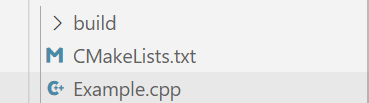
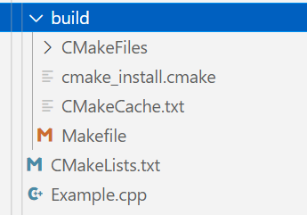
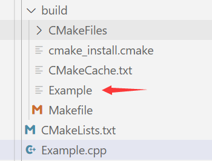

# 试试编译

## 建立CMakeLists.txt文件

在当前项目的目录下建立CMakeLists.txt文件，并输入以下内容：

```cmake
cmake_minimum_required(VERSION 3.10)
project(demo VERSION 1.00)
add_executable(Example Example.cpp)
```

我们在`Example.cpp`中随便写入些东西：

```
#include <iostream>
using namespace std;
int main(){
	cout << "This is an example!";
	return 0;
}
```

## 建立Build文件夹

在当前项目的目录下建立Build文件夹（名字不是Build也可以）：



进入build文件夹`cd build`，然后输入`cmake ../`执行CMakeLists.txt文件的内容：

> 注意，我们要在build文件夹中输入cmake ../。这样生成的附加文件就会在build文件夹中，不会污染目录结构。

```
cmake ../
-- Configuring done
-- Generating done
-- Build files have been written to: /root/...
```



这时build文件夹就会有生成Makefile文件

## 执行Makefile文件编译

1. 我们可以直接在build文件夹内输入`make`执行Makefile文件进行编译
2. 我们也可以输入`cmake --build 目录`进行编译

```
make
[ 50%] Building CXX object CMakeFiles/Example.dir/Example.cpp.o
[100%] Linking CXX executable Example
[100%] Built target Example
```

```
cmake --build ./
[ 50%] Building CXX object CMakeFiles/Example.dir/Example.cpp.o
[100%] Linking CXX executable Example
[100%] Built target Example
```

这时，我们build文件夹内就会生成可执行文件了！


