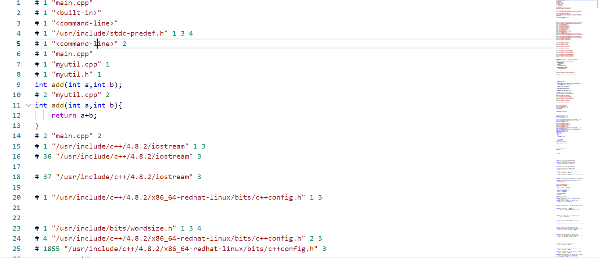
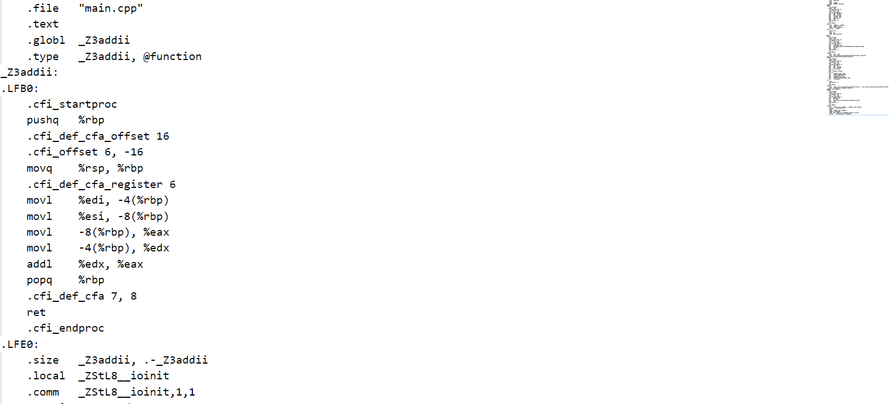

# 编译原理

## 文件结构

```cpp
//main.cpp
#include "myutil.h"
#include <iostream>
using namespace std;
int main(){
    cout << add(1,2);
}

//myutil.h
int add(int a,int b);

//myutil.cpp
#include "myutil.h"
int add(int a,int b){
    return a+b;
}
```


## 1.预处理

1. 将所有的“#define”删除，并且展开所有的宏定义
2. 处理所有的条件编译指令，比如“#if”、“#ifdef”、“#elif”、“#else”、“#endif”
3. 处理“#include”预编译指令，将被包含的头文件插入到该编译指令的位置。（这个过程是递归进行的，因为被包含的文件可能还包含了其他文件）
4. 删除所有的注释“//”和“/* */”。
5. 添加行号和文件名标识，方便后边编译时编译器产生调试用的行号心意以及编译时产生编译错误或警告时能够显示行号。
6. 保留所有的#pragma编译指令，因为编译器需要使用它们。

预览预处理结果 `g++ -E main.cpp  -o main.i`




## 2.汇编转化(编译)

编译过程就是把预处理完的文件进行一系列词法分析、语法分析、语义分析以及优化后生成相应的汇编代码文件。

预览编译结果`g++ -S main.i -o main.s`



## 3.机器语言转化(汇编)

将汇编语言转化为机器语言，生成目标文件（二进制文件，无法被执行）

`g++ -c main.s -o main.o`

## 4.链接

具体原理请看：[(15条消息) 编译过程中链接器的作用_Jeff_的博客-CSDN博客](https://blog.csdn.net/weixin_40539125/article/details/90734973)

main的编译过程中，add函数始终只有一个声明，并没有函数体。而链接过程便是把add函数的函数体找到。

我们将`myutil.cpp`按照上面的所有操作生成`myutil.o`的目标文件

再输入`g++ main.o myutil.o -o main`生成main的可执行文件。

## 5.一键编译

 为了简化上述四步，一般情况下只需要输入`g++ main.cpp -o main`即可
