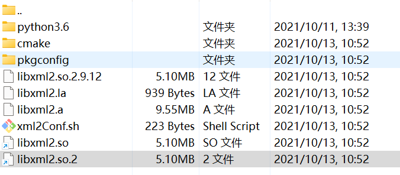

# 使用动态链接库

## 参数

`-I 头文件文件夹` 提供头文件目录，在预处理过程中可以在此目录搜索头文件

`-L 库文件目录`提供库文件目录

`-l动态链接库` 载入动态链接库

## 例子

首先预处理：

`g++ -E main.cpp -o main.i -I /usr/local/include/libxml2/`

然后对预处理文件进行编译：

`g++ -S main.i -o main.s`

编译后得到汇编语言，在进行汇编得到目标文件：

`g++ -c main.s -o main.o`

得到目标文件后，不能直接链接，因为g++并不知道libxml2头文件中声明的定义在哪，因此需要提供库文件目录：

`g++ main.o -L /usr/local/lib -lxml2`

## -l的具体使用方法

可能看完上面的例子会觉得很奇怪，为什么`-lxml2`中间没有空格？

我们看看`/usr/local/lib`目录中的文件

我们发现有`libxml2.so`的动态链接库。`-l`后面直接加动态链接库名字，忽略前缀lib和后缀so，因此就是`-lxml2`。因此，`-lxml2`也就是指的`libxml2.so`。

