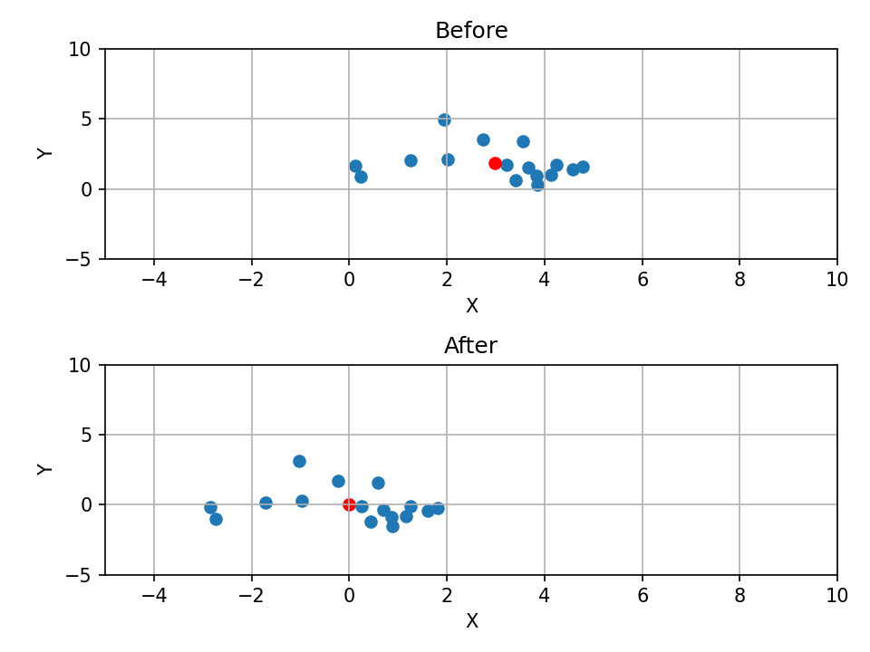

# 协方差矩阵

> [!NOTE] 参考文章：https://blog.csdn.net/Zijie123pea/article/details/115864880

## 均值的概念

假设有矩阵$ \textbf{X}_{a\times N} $。如果这个矩阵是**观测矩阵**，那么这个矩阵的每一个列向量$ \textbf{x}_{a\times 1} $为**观测向量**。

那么对于这个观测矩阵的均值为：
$$
\textbf{O} = [1]_{N\times 1}
\\\ 
\\
\textbf{m}=\frac{1}{N}\textbf{X}\textbf{O}
$$
那么均值$\textbf{m}$则为这个观察矩阵的均值。

## 观察矩阵的平均偏移形式

平均偏移： $\textbf{B} = \textbf{X}-\textbf{m}$

## 协方差矩阵

$$
Co = \frac{1}{N-1}B^TB

$$

> [!TIP] 注意协方差矩阵的对角线上的元素$a_{ii}$代表第i个变量的方差，非对角线上元素$a_{ij}$则代表第i个与第j个变量之间的协方差。所以，$tr(Co)$则代表了数据的总方差。

> [!NOTE] 具体例子可以看参考文章，里面有代入数据的演示。

