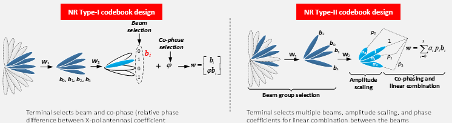
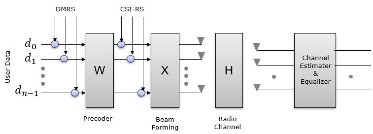
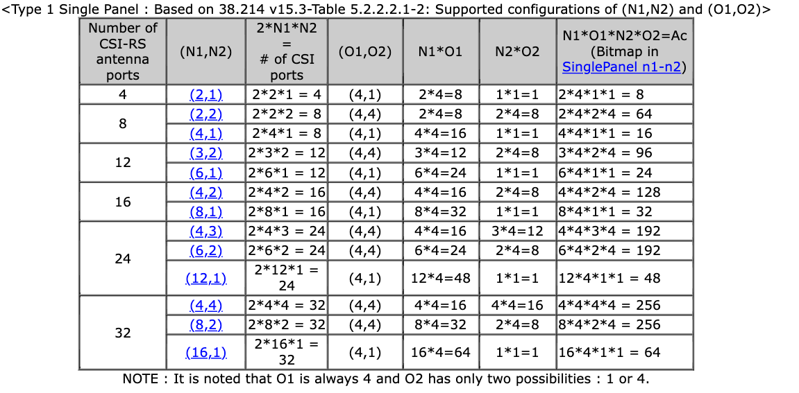
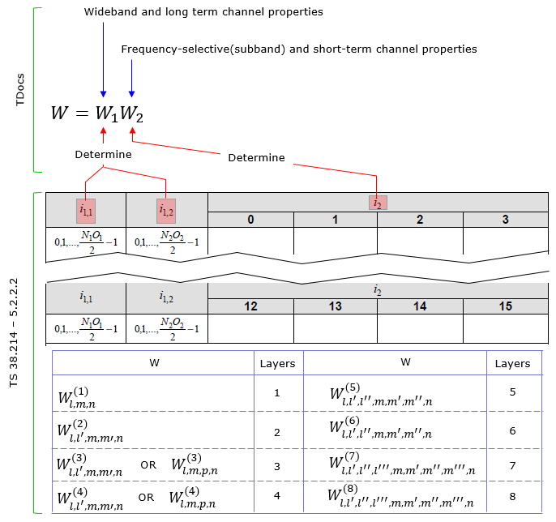
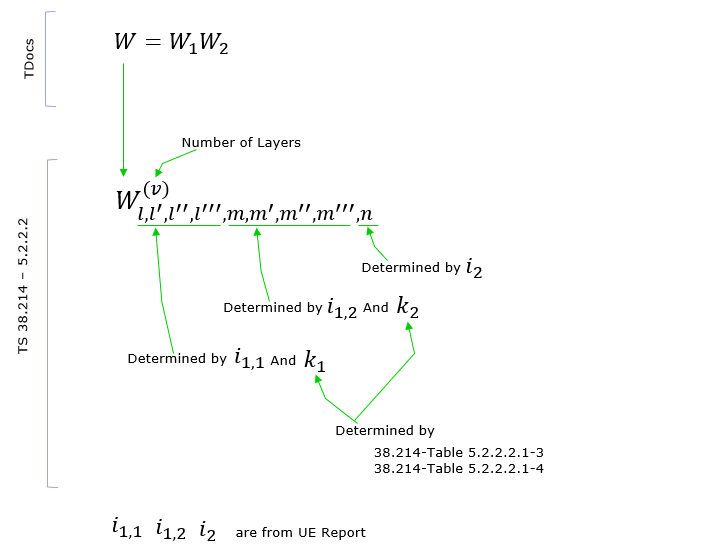
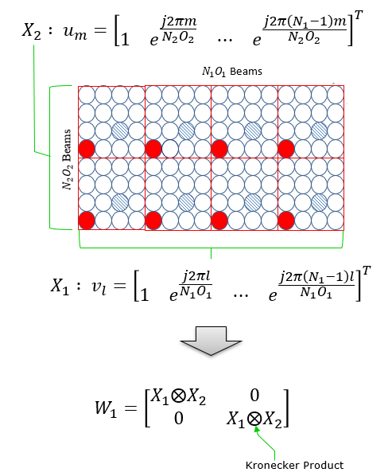

# PMI - Precoding Matrix Indicator

> [!NOTE] 参考文章：
> 
> [ShareTechNote] https://www.sharetechnote.com/ （文中图文大多来自其中）
> 
> [5G Testing: 3GPP Beam Management] https://blogs.keysight.com/blogs/inds.entry.html/2020/02/28/5g_testing_3gpp_bea-wkdn.html

## 什么是码本

在CSI-RS中，码本是许多precoder（Precoding Matrix）构成的集合。物理意义上，他将数据bit（PDSCH-Physical Downlink Shared Channel 物理下行共享信道，用于传输用户数据）映射到另一组数据对应到天线端口上。

## 码本的类型

由于项目暂时只关注TypeI码本，因此TypeII暂不考虑：

**TypeI的码本:** 主要用于SU-MIMO（单用户），可以提供比较高阶的空间复用，单用户最多可以支持到8个layer。这种场景相对简单，**预编码矩阵主要目的是使得接收端可以得到比较高的能量**。而潜在的layer之间的干扰，主要由接收机的多天线来解决。在TypeI中，码本使用一些预先定义的矩阵。

## 参考信号的理解

数据从基站传输到UE时会经过预编码矩阵，波束赋形矩阵，信道矩阵。因此要在UE端解开原始数据（**具体为什么可以解开，暂未了解**），需要加入已知的参考信号，根据参考信号的变化来求经过的矩阵。

如果我们在以上两个位置加入DMRS和CSI-RS参考信号，那么UE端只能计算出$WXH$和$XH$，不能独立的算出每一个值（好像W可以算出来，不过应该在UE端计算会消耗UE端运算资源，这样不合适）

## UE和基站如何知道precoder信息

UE可以通过上报PMI到基站，建议基站使用某个precoder。但基站不一定会采用（根据基站的实际情况判断）。即使基站没有采用UE建议的precoder，UE也能通过DMRS参考信号解出原始数据。这对于PDSCH来说是足够的（因为用户只需要知道原始数据就好？）

在基站方面，基站告诉UE发送SRS信号并根据它发送的SRS信号选择适合的PMI（此处假设信道互易性Channel reciprocity良好，基站可以通过SRS信号来判断信道质量，并可以以此选择下行的beam），然后告诉UE去使用特定的PMI。因此UE只能使用基站指定的Precoder。

## 基本术语

$N_1,N_2$指的是水平和垂直方向的天线数量$O_1,O_2$与**DFT Oversampling**有关，也就是在进行波束扫描（Beam sweeping）的时候的steps，$O_1$决定水平方向，$O_2$决定垂直方向。若$O_1,O_2$越大，波束就可以在更小的steps上扫描，得到更好的角度。

## N1 N2 O1 O2的规定配置

可以发现$O_1$一定是4，$O_2$只能是4和1。

## W矩阵从何而来

可以发现，$i_{1,x}$决定了宽带（wideband）属性，$i_2$决定了子带（subband）属性。而$i_3$在多层layers的时候需要（暂时不知道有啥用）。

下面是$W_1$的计算过程，可以发现，矩阵的大小和天线的结构有关。这个矩阵的每一列代表了一个antenna array产生的beam。

$W_2$则代表了beam的选择。
### PMI配置

#### typeI-SinglePanel-ri-Restriction

这是一个8比特的序列，$r_7,r_6,\dots,r_0$，其中$r_0$是LSB。如果$r_i$是0，那么PMI和RI不允许上报到任何与层数$v=i+1$相关的precoder不允许上报。

#### 两个端口的情况

codebookType（这是更高层的参数）会明确配置Type I并且是Type I-SinglePanel。如果nrOfAntennaPorts=2时，那么只能选择layer1和layer2，这样场景就比较简单。此时参数twoTX-CodebookSubsetRestriction有6个bit。如果gNB向终端发送的bits map中的某一位置0，意思为不允许终端使用这个码本。

#### 大于两个端口的情况

条件：nrOfAntennaPorts=4,8,12,16,24,32。并且UE将codebookType配置为TypeI-SinglePannel。

##### n1-n2参数

n1-n2也是bitmap，bit序列为$a_{A_c-1},\dots,a_1,a_0$，其中$a_0$是LSB。其中如果有bit置0，则代表与这个bit相关联的precoder不允许被上报。其中$A_c = N_1N_1O_1O_2$，但是当层数$v \in \{3,4\}$并且天线端口数量为16, 24, or 32，比特$a_{N_2O_2l+m}$与基于$v_{l,m}(l=0,\dots,N_1O_1-1, m=0,\dots,N_2O_2-2)$的所有的precoder相关联。

#### typeI-SinglePanel-codebookSubsetRestriction-i2

若高层参数reportQuantity配置为cri-RI-i1-CQI。则bitmap参数typeI-SinglePanel-codebookSubsetRestriction-i2会生成16个bit的序列$b_15,b_14,\dots,b_0$，其中$b_i$与$i_2 = i$的码本索引对应。当$b_i$为0时，为CQI计算随机选择的precoder不允许上报到任何与$b_i$相关联的precoder上。