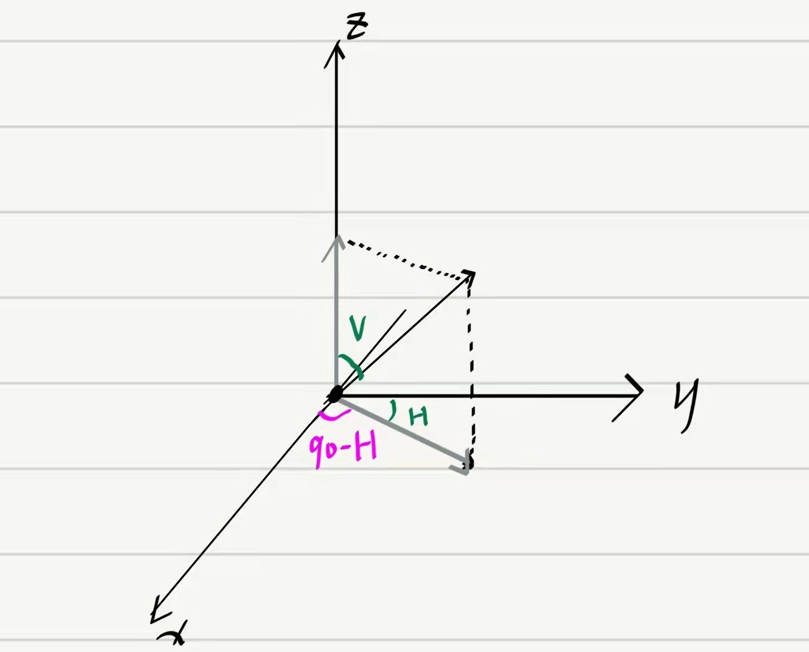

# 代码分析

2022/3/16

-------

## 参数说明

```python
numHAnt = 8
numVant = 4

HSpacing = 0.5
VSpacing = 0.7

downtilt = 0
enbleReadBeams = 1

H_angles = np.array(np.arange(-80,81,1),np.float)
V_angles = np.array(np.arange(-60,61,1),np.float)

Beam_path = 'Data/CSIRS_4ports_full.csv'
```

numHAnt与numVant为水平和垂直方向的天线数量，现在水平为8个天线，垂直为4个天线。

HSpacing与VSpacing则为水平天线之间的距离和垂直天线之间的距离，水平距离是0.5，垂直距离是0.7.**（问题：单位是什么）**

downtilt 是指天线的俯角。

enableReadBeams则表示是否从外部读入beams

H_angles和V_angles代表一根天线发射水平和垂直角度范围。当前设定为水平角度为[-80,80]，垂直角度为[-60,60]，并且取的角度均为整数。

## 读入beams

```python
Beam_path = 'Data/CSIRS_4ports_full.csv'
weight_data = np.loadtxt(Beam_path,delimiter=",")
weight = weight_data[:,np.arange(0,weight_data.shape[1],2)]+1j*weight_data[:,np.arange(1,weight_data.shape[1],2)]
```
Beam_path代表读取的beams文件路径

weight_data为读入beams矩阵，其形状为32x4，矩阵的0，2列为实部，1，3列为虚部。其中0，1列代表了天线阵子的第一个极化，2，3代表第二个极化。

weight则为32x2的矩阵，其类型为复数。

## **获取信道（getChannel）

```python
channel = get_channel(H_angles,V_angles,numHAnt,numVant)
```
### 函数输入输出

**输入**：
```python
def get_channel(H_angles=[], V_angles=[], numHant=8, numVant=4, HSpacing=0.5, VSpacing=0.7,downtilt=0):
```
H_angles，V_angles，分别是水平角度数组和垂直角度数组。

numHAnt，numVant分别是水平天线数量和垂直天线数量。

HSpacing，VSpacing分别是水平天线距离和垂直天线距离。

**downtilt **。

**输出**：channel，信道矩阵，形状为19481x32

### 内部运算分析

#### 计算天线坐标
```python
HAnt_pos = HSpacing * np.repeat(np.expand_dims(np.arange(0, numHant), 0), numVant, 0)
VAnt_pos = VSpacing * np.repeat(np.expand_dims(np.arange(0, numVant), 1), numHant, 1)
HAnt_pos = np.reshape(HAnt_pos,(-1,1))
HAnt_pos = HAnt_pos.transpose(1,0)
VAnt_pos = np.reshape(VAnt_pos,(1,-1))
```

> [!TIP] `np.expand_dims(array_like, axis)` 即增加矩阵的第axis个轴。例如`x = np.array([1,2])`，那么x为`[1,2]`，形状为2。如果此时输入`np.expand_dims(x,axis=1)`，那么x就会变成`[[1,2]]`，此时的形状为1x2。

`HSpacing * np.expand_dims(np.arrange(0,numHant),0)`首先得到一个$\textbf{h} = [0,1,2,3,4,5,6,7]$的行向量，代表水平上每根天线距离距离第一根天线的距离。然后将向量升维为1x2的矩阵（是否可以省略这一步）。然后将这个向量在0维度（行）复制$numVant =4$次，得到$\textbf{H} = [\textbf{h}, \textbf{h}, \textbf{h},\textbf{h}]^T$。最后乘上每两根水平天线之间的距离，得到：
$$

HSpacing*\textbf{H} = 
\begin{bmatrix}
0 & d_1 & d_2 & \dots & d_7 \\
\vdots & \vdots & \vdots & \dots & \vdots \\
0 & d_1 & d_2 & \dots & d_7
\end{bmatrix}
\\
$$
结果得到一个矩阵形状为(numVant,numHant)，分别代表了每个天线的水平坐标。暂且将这个矩阵称为天线的水平坐标矩阵。然后`HAnt_pos = np.reshape(HAnt_pos,(-1,1))` `HAnt_pos = HAnt_pos.transpose(1,0)`将原本水平坐标矩阵拉伸为一列向量然后再转置为行向量，最后得到$\textbf{D}_h = [0,d_{1h},d_{2h},\dots,d_{7h},\dots,0,d_{1h},d_{2h},\dots,d_{7h}]$。

> [!TIP] 其实这里HAnt_pos可以一步完成：
>   ```python
> HAnt_pos = np.reshape(HAnt_pos,(1,-1))
> VAnt_pos = np.reshape(VAnt_pos,(1,-1))
> ```

对于垂直方向最后也同理得到$\textbf{D}_v = [0,d_{1v},d_{2v},\dots,d_{7v},\dots,0,d_{1v},d_{2v},\dots,d_{7v}]$。

#### 计算信道角度
```python
H_channel_angles = np.repeat(np.expand_dims(H_angles, 1), V_angles.size, 1)
V_channel_angles = np.repeat(np.expand_dims(V_angles, 0), H_angles.size, 0)
H_channel_angles = 90-H_channel_angles
```
> [!TIP] 这一步可以用meshgrid实现，[H_channel_angles,V_channel_angles] = np.meshgrid(V_angles, H_angles)



H_angles在axis=1处增加了一个维度，则生成了一个维度为161的列向量，然在axis=1处repeat了V_angles.size次，于是生成了161x121的矩阵：
$$
\textbf{H}_{angles} = \begin{bmatrix}
-80 & -80 & \dots & -80 \\
-79 & -79 & \dots & -79 \\
\vdots & \vdots & \vdots & \vdots \\
80 & 80 & \dots & 80 
\end{bmatrix}
$$

而V_angles则先生成一个121维度的行向量，然后再在axis=0处repeat生成161x121的矩阵：

$$
\textbf{V}_{angles} = \begin{bmatrix}
-60 & -59 & \dots & 60 \\
-60 & -59 & \dots & 60 \\
\vdots & \vdots & \vdots & \vdots\\
-60 & -59 & \dots & 60
\end{bmatrix}
$$

这样就将空间中的每一个位置表现为矩阵中的角度坐标。例如(-80,-60)，(-80,-59)代表了天线指向的某个角度。

然后**90-H则将水平角位置从y轴表示转移到x轴表示**。

```python
[H_channel_angles, V_channel_angles] = AngleFromLtoG(H_channel_angles, V_channel_angles, downtilt)
```

##### AngleFormToG函数

```python
def AngleFromLtoG(H_angle,V_angle,downtilt):
  H_angle = H_angle/180*pi
  V_angle = V_angle/180*pi
  downtilt = downtilt/180*pi
  [lx,ly,lz] = sph2cart(H_angle,V_angle,1)
  R = np.array([[1,0,0],
       [0,np.cos(downtilt),-np.sin(downtilt)],
       [0,np.sin(downtilt),np.cos(downtilt)]]) 
  R = np.linalg.inv(R)
  L = np.array([lx,ly,lz])
  L = np.expand_dims(L,0)
  L = np.transpose(L)
  G = R@L
  G = np.transpose(G)
  G = G[0]
  [H_angle,V_angle,r] = cart2sph(G[0],G[1],G[2]) 
  H_angle = H_angle/pi*180
  V_angle = V_angle/pi*180
  return H_angle,V_angle

def sph2cart(az, el, r):
  rcos_theta = r * np.cos(el)
  x = rcos_theta * np.cos(az)
  y = rcos_theta * np.sin(az)
  z = r * np.sin(el)
  return x, y, z
  
def cart2sph(x, y, z):
  hxy = np.hypot(x, y)
  r = np.hypot(hxy, z)
  el = np.arctan2(z, hxy)
  az = np.arctan2(y, x)
  return az, el, r
```

H_angle/180*pi，V_angle/180*pi将角度表示换为弧度表示。

sph2cart函数将角位置表示(hangle,vangle) (注意这里的hangle已经转变为与x轴的夹角)转为(x,y,z)的坐标表示。

R矩阵的线性变换代表了将原xyz轴坐标系上的坐标变换到x轴不动yz旋转downtlit角的坐标上。

然后求R的逆矩阵（R是正交矩阵，逆矩阵等于其转置）。

L为(3,161,121)
