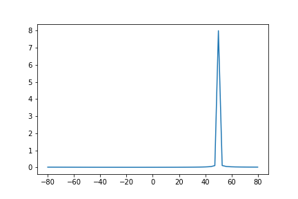

![!TIP] 参考资料 https://blog.csdn.net/weixin_39274659/article/details/108894763

# 一维DFT码本生成过程

> [!ATTENTION] 这里一定要注意，假设有两个复数向量$\textbf{a},\textbf{b}$，那么他们求内积的公式是$\textbf{a}^H\textbf{b}$，其中$H$指的是共轭转置
```python
import numpy as np
import matplotlib.pyplot as plt
from math import pi
if __name__ == "__main__":
    N = 64
    O = 1
    directions = np.arange(1/(N*O)-1,1+1/(N*O),2/(N*O))
    # 生成一维的DFT码本
    steps = np.arange(0,N,1)
    beam = 1j*pi*steps
    dft_codebook = np.exp(np.dot(beam.reshape(-1,1),directions.reshape(1,-1)))
    # 检验：生成某个方向的beam
    a = ((1/np.sqrt(N))*np.exp(1j*pi*steps*np.sin((50/180)*pi)))
    # a与dft_codebook相乘得到空间能量分布
    r = np.dot(a.conj().T,dft_codebook)
    # 绘图
    x = (np.arcsin(directions)/(pi))*180
    y = np.abs(r)
    plt.plot(x,y)
    plt.savefig("img/02.png")
```



# 多维DFT生成过程

TODO

# 项目代码分析
```python
def generate_dft_beams(numVant=4, numHant=8, OS_V=1, OS_H=1):
    V_step = np.arange(-(numVant-1)/2, (numVant-1)/2 + 1, 1, dtype=np.float32).reshape((-1,1))
    # V_step = [-1.5 -0.5 0.5 1.5]'
    V_beams = np.arange(-(numVant-1)/2, (numVant-1)/2 + 1, 1/OS_V, dtype=np.float32).reshape((-1,1))
    # V_beams = [-1.5 -1 -0.5 0 0.5 1 1.5]'
```
OS_V相当于把V_step中多分割几份，得到更细化的beam。
```python
    dft_beams_V = np.exp(np.dot(-1j*2*pi * V_step , V_beams.T / numVant)) 
```
这个代码生成(4,8)的矩阵，含义为
```python
    H_step = np.arange(-(numHant-1)/2, (numHant-1)/2 + 1, 1, dtype=np.float32).reshape((-1,1))
    H_beams = np.arange(-(numHant-1)/2, (numHant-1)/2 + 1, 1/OS_H, dtype=np.float32).reshape((-1,1))
    dft_beams_H = np.exp(np.dot(-1j*2*pi*H_step , H_beams.T / numHant))
 
    beams = np.kron(dft_beams_V,dft_beams_H)
 
    # import pdb;pdb.set_trace()
    return beams

aa = generate_dft_beams(4,8,2,1)
```