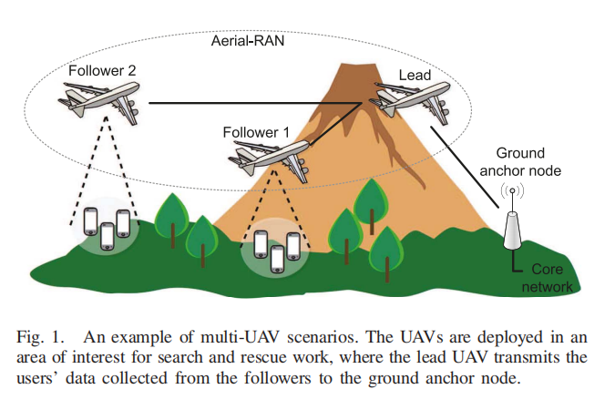
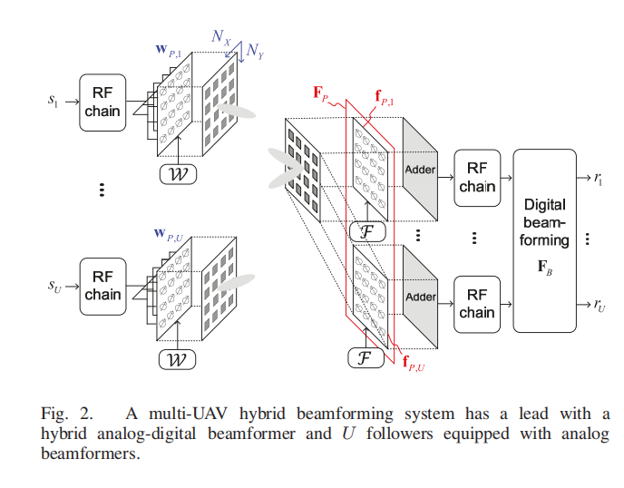
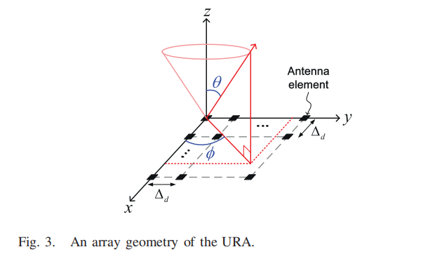

# Machine-Learning Beam Tracking and Weight Optimization for mmWave Multi-UAV Links

## Contributions

- **Only require the received coupling coeffcients as observations** to implement both the analog beam tracking and digital weight optimization.
- We **formulate the beam tracking problem using a
Q-learning model** and introduce how to use the coupling coefficients to design the rewards. **The proposed
method can stably track the beams in highly dynamic
environments.**
- To track the beams in highly dynamic UAV environments, the burden of pilot transmission is inevitable. **The
proposed beam tracking method uses current and past
observations to solve the prediction problem**. In such
a way, it **significantly increases the efficiency of data
transmission and beam switching**.
- **The selected analog beams based on the received power
estimates do not ensure that the hybrid beamforming
achieves the maximum SINR** (以最大能量选择的Beam不能保证最大的SINR). We manage to reserve
additional analog beams as candidates during the beam
tracking and then determine which combination of analog
beams with their digital weights achieves the maximum SINR. This idea can be simply implemented given the
coupling coefficients.

## System Model

> [!TIP] 这张图展示了1个Lead多个Follows的多UAV（unmanned aerial vehicles） beamforming系统。

假设UAVs在时间的频率上完美同步。Lead在同时使用同频率将U个数据流发送给U个Follows（采用SDMA-空分多址，利用天线朝向来区分数据流）。
每个UAV上都有$N=N_xN_y$个天线。

在动态环境下（也就是在离散时刻$t=0,...,T$），多UAV beamforming的目的就是最大化系统吞吐量（system throughput）或者最大化SINR。

在Lead上的t时刻，会使用U个模拟波束成形向量来接受特定方向的数据，波束成形向量记作
$$\textbf{f}_{P,u,t} \in \mathbb{C}^{N\times 1} $$
其中$u=1,...,U$，代表了Follower的ID
 
模拟波束成形向量作用在RF Chain输出的passband上。由于成本问题，一个RF Chain通过连接多个phase shifters，而模拟波束成形是phase shifters实现的。

将所有波束成形向量拼接成一个矩阵：

$$
\textbf{F}_{P,t}=[\textbf{f}_{P,1,t},...,\textbf{f}_{P,u,t}]\in \mathbb{C}^{N\times U}
$$

有一个预编码矩阵
$$
\mathcal{F} = \{\tilde{\textbf{f}}_{n_f}\in \mathbb{C}^{N\times 1}\ |\ ||\textbf{f}_{n_f}||_2^2=1, n_f=1,...N_F, N_F>U\}
$$

Lead的U个模拟波束成形向量从$\mathcal{F}$中选择。其中$\tilde{\textbf{f}}_{n_f}$代表$\mathcal{F}$中的第$n_f$个元素。

$$
\tilde{\textbf{f}}_{n_f}=\tilde{\textbf{f}}_{X,n_f} \otimes \tilde{\textbf{f}}_{Y,n_f}
$$

其中$\tilde{\textbf{f}}_{X,n_f}\in \mathbb{C}^{N_x\times 1}$，$\tilde{\textbf{f}}_{Y,n_f}\in \mathbb{C}^{N_y\times 1}$。

$$
[\tilde{\textbf{f}}_{X,n_f}]_{n_x} = \frac{exp(-j2\frac{pi}{\lambda_0}cos(\phi_{n_f})sin(\theta_{n_f}(n_x-1)\Delta_d)}{\sqrt{N_x}}

\\

[\tilde{\textbf{f}}_{X,n_f}]_{n_y} = \frac{exp(-j2\frac{pi}{\lambda_0}cos(\phi_{n_f})sin(\theta_{n_f}(n_y-1)\Delta_d)}{\sqrt{N_y}}
$$

